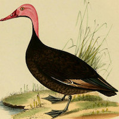

# Exam: HTML & CSS

### Getting Started
 - Fork this repository under your own account
 - Commit your progress frequently and with descriptive commit messages
 - All your answers and solutions should go in this repository

### What can I use?
 - You can use any resource online, but **please work individually**
 - Instead of copy-pasting your answers and solutions, write them in your own words.


# Tasks

## 1. Build a design (~90 minutes) [10 points]
Build the following profile cards according to the design provided.   
Follow the design as closely as possible.   
Commit an HTML and a CSS file to this repository.


### Assets
John Duck | Jane Duck | Pencil icon
--------- | --------- | -----------
 |  |    

### Other data
  - Name font size: 28 pixels
  - Text size: 14 pixels
  - Font family: Arial, sans-serif

### Acceptance criteria
The task is accepted if:
  - The result follows design [2p]
  - The code follows style guide [1p]
  - The CSS & HTML are valid [1p]
  - The HTML considers semantic responsibilities [2p]
  - The code avoids code duplication [2p]
  - The CSS has meaningful and short selectors [2p]

Extra points for if:
  - the result is centered on the page [2p]


## 2. Understand code (~15 minutes) [2 points]
Read the following code snippet:   
What is the distance between the top-left corner of the document body and the yellow box?   
Give a detailed explanation below!   
Add your answer to this readme file, commit your changes to this repository.
```HTML
<!DOCTYPE html>
<html>
  <head>
    <style>
      body {
        padding: 0px;
        margin: 0px;
      }
      .foo {
        top: 20px;
        left: 20px;
        width: 100px;
        height: 100px;
        position: absolute;
        background: blue;
      }
      .bar {
        top: 20px;
        left: 20px;
        width: 30px;
        height: 30px;
        position: absolute;
        background: yellow;
      }
    </style>
  </head>
  <body>
    <div class="foo">
      <div class="bar"></div>
    </div>
  </body>
</html>
```
#### Your answer: [2p]

The distance will be 40px from the right and from the top as well. Because the .foo element is the parent element what has an absolute position and the distance of 20px from the top and the left side of the document so the .bar element is the child what has got the same distances. But this 20px is counted from the side of the parent element what has got a 'position: absolute' value. This is establish containing elements as positioning ascestors.

.foo left: 20px + .bar left: 20px = 40px
      top: 20px +       top: 20px = 40px


## 3. Explain concepts (~15 minutes) [4 points]
Add your answer to this readme file, commit your changes to this repository.


### Explain the difference between `display: block` and `display: inline` in CSS! What is `display: inline-block`?
#### Your answer: [2p]


### What is the difference between a `<section>` and an `<article>` element? Name one good example of using an `<article>`.
#### Your answer: [2p]
